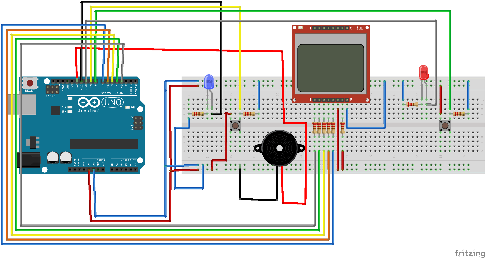

# Kim Butona İlk Bastı? - Oyun Devresi

Bu proje, iki oyuncunun rastgele bir süre sonunda butona hızlı bir şekilde basarak puan kazandığı eğlenceli bir oyun devresidir. LCD ekranda anlık skorlar görüntülenir.

## Gereksinimler

- Arduino UNO
- 1x Adafruit PCD8544 (Nokia 5110) LCD Ekran
- 1x Buzzer
- 2x Buton
- 2x LED (Kırmızı ve Mavi)
- Dirençler ve Jumper Kablolar

## Devre Şeması

## Kurulum

1. Bağlantıları yukarıdaki devre şemasına göre yapın.
2. Kodu Arduino IDE’ye yükleyin.
3. Oyun hazır! İki oyuncu butonlara basarak oyunu oynayabilir.

## Pin Tanımlamaları

| Komponent        | Pin Numarası |
| ---------------- | ------------ |
| LCD CLK          | 7            |
| LCD DIN          | 6            |
| LCD DC           | 5            |
| LCD CE           | 4            |
| LCD RST          | 3            |
| Kırmızı LED      | 10           |
| Mavi LED         | 11           |
| Buzzer           | 12           |
| 1. Buton         | 8            |
| 2. Buton         | 9            |

## Nasıl Çalışır?

- Oyun başladığında ekranda "Oyun Başlıyor!" mesajı görünür.
- Rastgele bir süre sonra buzzer çalar.
- İlk kim butona basarsa o oyuncu bir puan kazanır ve ilgili LED yanar.
- Skorlar LCD ekranda güncellenir.
- Her turdan sonra oyun tekrar başlar.

## Geliştirme Fikirleri

- Puanları belli bir sayıya ulaşan oyuncu kazanacak şekilde ayarlayabilirsiniz.
- Daha fazla oyuncu için ek butonlar ve LED'ler ekleyebilirsiniz.
